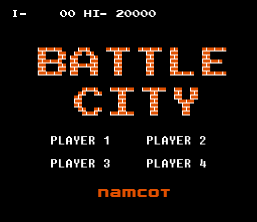

# Gamepad

## Overview

A small project that people are able to play games together with their mobile phones + a screen(PC). It supports the maximum of 4 players at the same time. Techniques used in this project are mainly nodejs, socket.IO and Express.

### PC end

### Mobile end

## Techniques and Setting

## Direction to use/play

1.Open command line, entre the program folder type command "node GameServer.js"
2.Visit http://localhost:3100/game on cumputer(mobile is fine as well).
3.Visit http://localhost:3100/gamepad/ on mobile browser.
4.Press select and start. （if multiple players, press select to get ready, one player press start to begin the game）.

Existing problems

1.Disorder (I have no time to make codes clear and add comments).
2.Having no ready phase to syn all users.
3.Press the button on mobile, you will see a problem with btn pictures.
....
