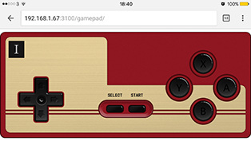

# Gamepad

### Overview

A small project that people are able to play games together with their mobile phones + a screen(PC). It supports the maximum of 4 players at the same time. Techniques used in this project are mainly nodejs, socket.IO and Express.

##### PC end

##### Mobile end

## Direction to use/play

- Open command line, entre the program folder type command "node GameServer.js"

- Visit http://localhost:3100/game on cumputer(mobile is fine as well).

- Visit the PC through IP address + "gamepad" from mobile phone, like http://192.168.0.192:3100/gamepad/ in my case.

- Press select and start. （if multiple players, press select to get ready, one player press start to begin the game）.

## Existing problems

- Mess (I have no time to make codes clear and add comments).

- Have no ready stage to syn all users.

- Button images on the mobile end flashing.

....
